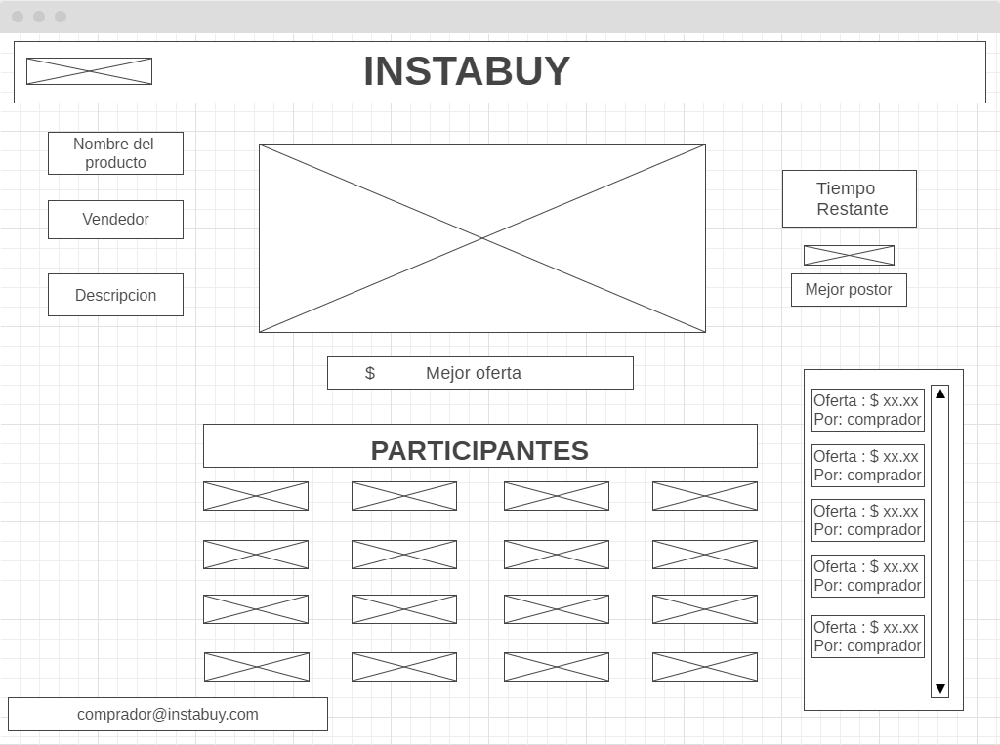
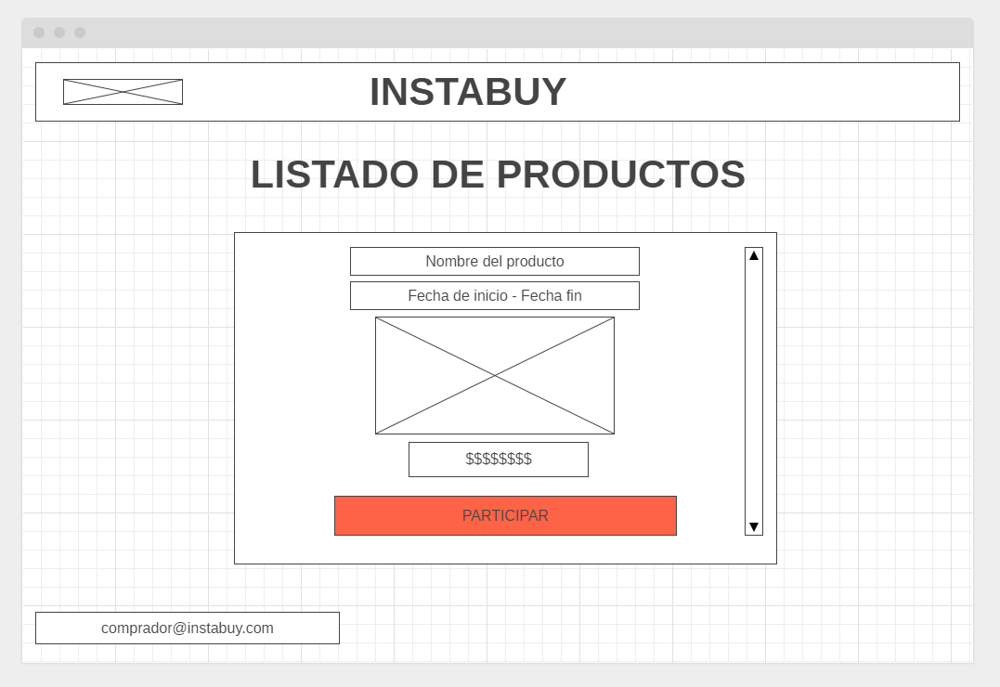
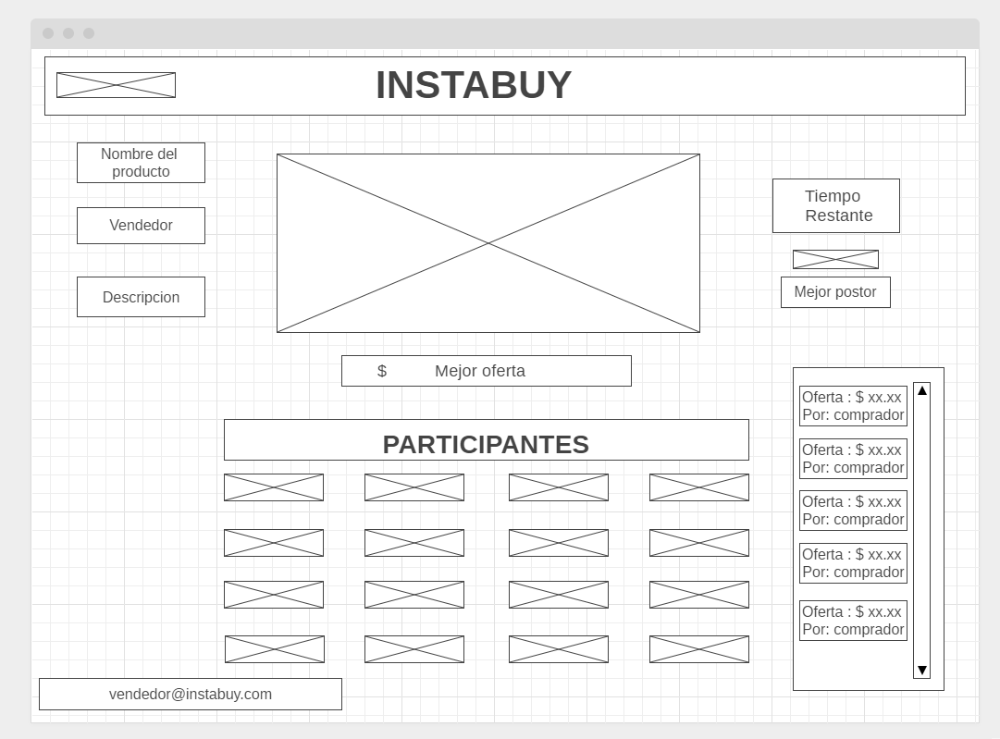
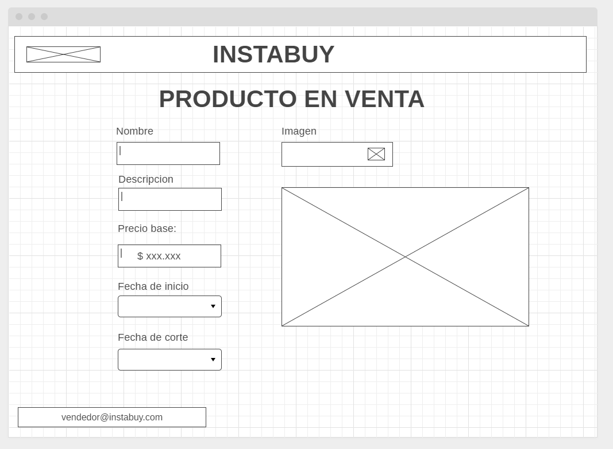
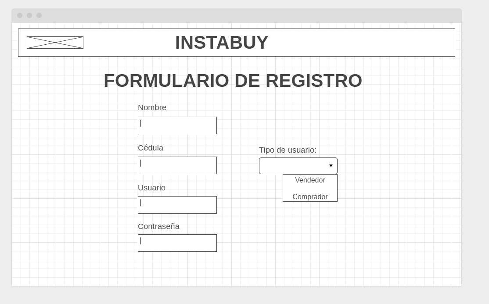
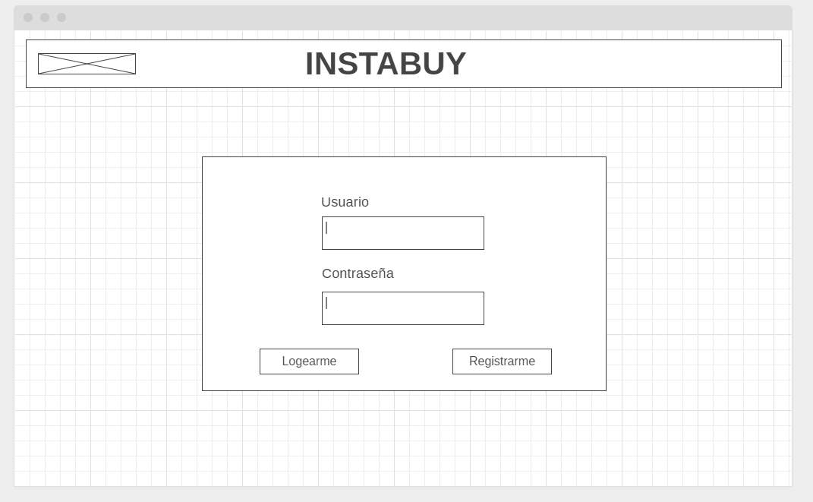

# SPRINT 2 Avance funcional - Proyecto ARSW - INSTABUY

## LOGO

## INTRODUCTION

INSTABUY - Sistema de gestión de subastas de articulos

INSTABUY es una aplicación web diseñada para realizar venta de productos por medio de ofertas en tiempo real desde la comodidad de un solo click.

## HISTORIAS DE USUARIO

[TRELLO](https://trello.com/b/zXhEXtKA/historias-de-usuario-instabuy)

## INSTABUY-BACKEND

[BACKEND](https://github.com/InstabuyDeveloper/Instabuy-Backend)

## INSTABUY-FRONTEND

[FRONTEND](https://github.com/InstabuyDeveloper/Instabuy-Frontend)

## DESCRIPTION

Dos tipos de usuario: 

* Comprador : Persona que oferta por un producto	

### Vista de la subasta 

### Vista listado de productos

	
* Vendedor : Persona que quisiera vender un producto

### Vista de la subasta

## Vista venta de producto

## Vista formulario de registro

## Vista login

## VENTAJAS
* Permite que tanto el comprador como el vendedor se vean beneficiados de la subasta
* Amplia gama de tipos de productos ofrecidos
* Genera pruebas de los diferentes movimientos realizados (Venta o oferta)
* Evita que sea necesario desplazarse o ir de forma fisica a la tienda o hacia el vendedor

## VALOR AGREGADO

* Se puede generar un historial de la subasta para un mayor analisis y generar mayores ganancias
* Facil acceso y diseño intuitivo
* Forma dinamica de realizar una subasta
* Se crea una sala para la subasta del producto y ofertar en vivo.

## PRINCIPAL COMPETIDOR
[Ebay](https://www.ebay.com/) - Sistema de subastas en internet
* Las subastas no son en vivo y en directo.

 
## AUTHOR

* **JUAN CAMILO ORTIZ MEDINA** - [Juaco9502](https://github.com/juaco9502)

## LICENSE

This project is licensed under the GNU General Public License - [LICENSE](LICENSE) 